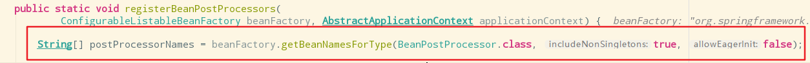
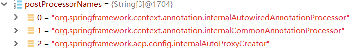
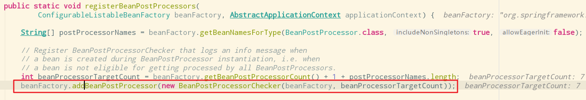
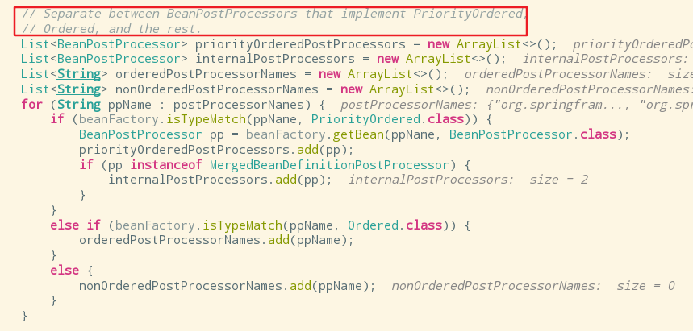
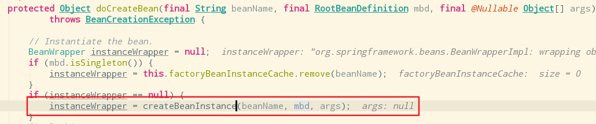
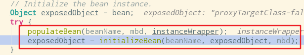
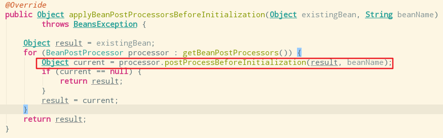

# 一、@EnableAspectJAutoProxy原理

aop原理：【看给容器中注册了什么组件，这个组件什么时候工作，这个组件的功能是什么？】

1）、@EnableAspectJAutoProxy是什么？

@Import(AspectJAutoProxyRegistrar.class)给容器中导入组件AspectJAutoProxyRegistrar

​				利用AspectJAutoProxyRegistrar自定义给容器注册bean：

​						internalAutoProxyCreator=AnnotationAwareAspectJAutoProxyCreator，给容器中注册一个AnnotationAwareAspectJAutoProxyCreator的组件

2）、AnnotationAwareAspectJAutoProxyCreator

​				-->AspectJAwareAdvisorAutoProxyCreator

​						-->AbstractAdvisorAutoProxyCreator

​								-->AbstractAutoProxyCreator

​										implements SmartInstantiationAwareBeanPostProcessor, BeanFactoryAware

关注后置处理器(在bean初始化前后做的事情)、自动装配beanFactory


AbstractAutoProxyCreator.setBeanFactory()    aware的特点AbstractAutoProxyCreator.postProcessBeforeInstantiation()等是后置处理器的逻辑


AbstractAdvisorAutoProxyCreator.setBeanFactory()-->initBeanFactory()    AbstractAdvisorAutoProxyCreator重写了父类AbstractAutoProxyCreator()的setBeanFactory() 方法，所以调用的是子类的方法AnnotationAwareAspectJAutoProxyCreator.initBeanFactory()

流程：

1）、传入配置类，创建ioc容器

```java
ApplicationContext context = new AnnotationConfigApplicationContext(MainConfigOfAOP.class);
```

2）、注册配置类，调用refresh()刷新容器

```shell
public AnnotationConfigApplicationContext(Class<?>... annotatedClasses) {
		this();
		register(annotatedClasses);
		refresh();
	}
```

3）、registerBeanPostProcessors(beanFactory);注册bean的后置处理器来方便拦截bean的创建

```shell
registerBeanPostProcessors(beanFactory);
```

​		1、先获取ioc容器中已经定义的需要创建对象的所有BeanPostProcessor



​		

​		2 、给容器中加入别的BeanPostProcessor

​		3、先给processor分类



3、优先注册实现了PriorityOrdered接口的BeanPostProcessor

```java
// First, register the BeanPostProcessors that implement PriorityOrdered.
		sortPostProcessors(priorityOrderedPostProcessors, beanFactory);
		registerBeanPostProcessors(beanFactory, priorityOrderedPostProcessors);
```

​		4、再给容器中注册实现了Ordered的BeanPostProcessor

```java
// Next, register the BeanPostProcessors that implement Ordered.
		List<BeanPostProcessor> orderedPostProcessors = new ArrayList<>();
		for (String ppName : orderedPostProcessorNames) {
			BeanPostProcessor pp = beanFactory.getBean(ppName, BeanPostProcessor.class);
			orderedPostProcessors.add(pp);
			if (pp instanceof MergedBeanDefinitionPostProcessor) {
				internalPostProcessors.add(pp);
			}
		}
		sortPostProcessors(orderedPostProcessors, beanFactory);
		registerBeanPostProcessors(beanFactory, orderedPostProcessors);
```

​		5、注册没实现优先级接口的BeanPostProcessor

```java
// Now, register all regular BeanPostProcessors.
		List<BeanPostProcessor> nonOrderedPostProcessors = new ArrayList<>();
		for (String ppName : nonOrderedPostProcessorNames) {
			BeanPostProcessor pp = beanFactory.getBean(ppName, BeanPostProcessor.class);
			nonOrderedPostProcessors.add(pp);
			if (pp instanceof MergedBeanDefinitionPostProcessor) {
				internalPostProcessors.add(pp);
			}
		}
		registerBeanPostProcessors(beanFactory, nonOrderedPostProcessors);
```

​		6、注册BeanPostProcessor，实际上就是创建BeanPostProcessor对象，保存在容器中

​				创建internalAutoProxyCreator[AnnotationAwareAspectJAutoProxyCreator]

​					1)、创建bean的实例



​					2)、populate：给bean的各种属性赋值

​					3)、initializeBean:初始化bean



​								1、invokeAwareMethods：处理Aware接口的方法回调

```java
private void invokeAwareMethods(final String beanName, final Object bean) {
		if (bean instanceof Aware) {
			if (bean instanceof BeanNameAware) {
				((BeanNameAware) bean).setBeanName(beanName);
			}
			if (bean instanceof BeanClassLoaderAware) {
				ClassLoader bcl = getBeanClassLoader();
				if (bcl != null) {
					((BeanClassLoaderAware) bean).setBeanClassLoader(bcl);
				}
			}
			if (bean instanceof BeanFactoryAware) {
				((BeanFactoryAware) bean).setBeanFactory(AbstractAutowireCapableBeanFactory.this);
			}
		}
	}
```

​							2、applyBeanPostProcessorsBeforeInitialization():应用后置处理器的BeforeInitialization()



​						3、invokeInitMethods()：执行自定义的初始化方法

​						4、applyBeanPostProcessorsAfterInitialization()：执行后置处理器的postProcessAfterInitialization()方法

​				4）、AnnotationAwareAspectJAutoProxyCreator创建成功


======以上是创建和注册AnnotationAwareAspectJAutoProxyCreator的过程==========


 	