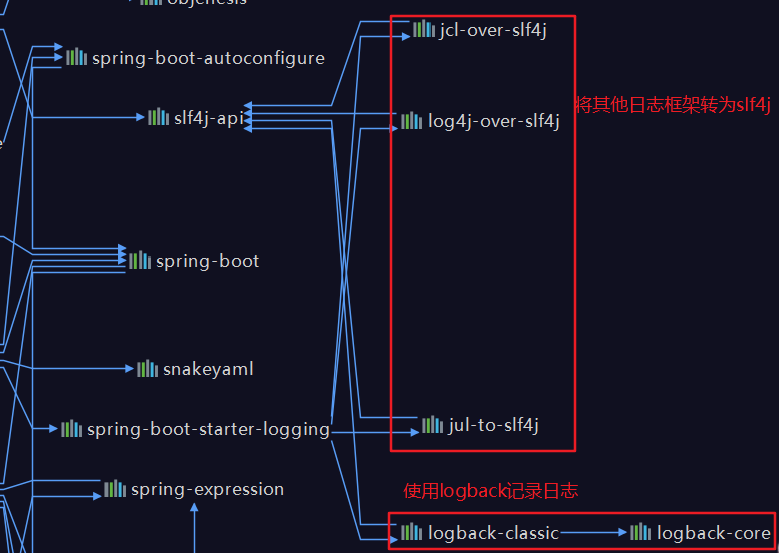

# 三、springboot与日志

## 1、日志框架

| 日志门面(日志抽象层)      | 日志实现            |
| ------------------------- | ------------------- |
| JCL、SLF4J、jboss-logging | log4j、JUL、logback |

左边选一个门面(抽象层)、右边来一个实现

日志门面：SLF4J

日志实现：logback

**springboot选用的是slf4j和logback**

## 2、SLF4J的使用

### 1、如何在系统中使用slf4j

```java
import org.slf4j.Logger;
import org.slf4j.LoggerFactory;

public class HelloWorld {
  public static void main(String[] args) {
    Logger logger = LoggerFactory.getLogger(HelloWorld.class);
    logger.info("Hello World");
  }
}
```

slf4j使用图示


每一个日志实现框架都有自己的配置文件，使用slf4j以后，**配置文件还是做成日志实现框架自己本身的配置文件**

### 2、遗留问题

a系统(logback)需要依赖spring(commons-logging)、Hibernate(jboss-loggig)...

统一日志记录，让别的框架也是用slf4j进行输出


**如何让系统中所有的日志都统一到slf4j;**

1、将系统中其他的日志框架先排除出去

2、用中间包来替换原有的日至框架

3、导入slf4j的其他实现

### 3、springboot的日志关系

```xml
<dependency>
			<groupId>org.springframework.boot</groupId>
			<artifactId>spring-boot-starter</artifactId>
		</dependency>
```

springboot使用它来做日志功能：

```xml
<dependency>
			<groupId>org.springframework.boot</groupId>
			<artifactId>spring-boot-starter-logging</artifactId>
		</dependency>
```

底层依赖关系



总结：

1、springboot底层也是使用slf4j和logback来记录日志

2、springboot也把其他的日志都替换成了slf4j

3、中间替换包

<span style="color:red;">4、如果我们要引入其他的框架，一定要把这个框架的默认日志依赖移除掉</span>

Spring框架用的是commons-logging;springboot使用spring框架首先就排除掉了commons-logging

```xml
<dependency>
			<groupId>org.springframework</groupId>
			<artifactId>spring-core</artifactId>
			<exclusions>
				<exclusion>
					<groupId>commons-logging</groupId>
					<artifactId>commons-logging</artifactId>
				</exclusion>
			</exclusions>
		</dependency>
```

**springboot能自动适配所有的日志，而且底层使用slf4j+logback的方式记录日志，引入其他框架的时候，只需要把这个框架以来的日志框架排除掉**

### 4、日志使用

#### 1、默认配置

springboot修改日志默认配置

```properties
#debug=true
server.port=80

#指定在哪个文件夹下的日志级别
logging.level.com.demo=trace

#不指定路径，在当前项目下生成log文件日志
#logging.file=log.file

#可以指定完整路径
#logging.file=D:\log.file

#在当前磁盘根路径下创建spring文件夹和里面的log文件夹，使用spring.log作为配置文件
#logging.path=/spring/log

#控制台输出的日志格式
logging.pattern.console=%{yyyy-MM-dd} [%thread] %-5level %logger{50} - %msg%n

#指定文件中日志输出格式
logging.pattern.file=%{yyyy-MM-dd} === [%thread] === %-5level === %logger{50} - %msg%n
```

```properties
日志输出格式：
	%d:示日期时间
	%thread:示线程名
	%-5level:级别从左显示5个字符宽度
	%logger{50}:logger名字最长50个字符，否则按照句号分割
	%msg:日志消息
	%n:换行符
```

#### 2、指定配置

给类路径下放上每个日志框架自己的配置文件即可；springboot就不使用它的默认配置了，每个框架文件名查看官方提供的名称


**官方推荐使用带spring后缀的配置文件**

logback.xml:直接被日至框架识别；

logback-spring.xml:日志框架无法直接识别配置文件，由springboot框架识别加载配置项，而springboot加载配置项，**可以指定某段配置只在某个环境下生效(多环境配置)**

```xml
<springProfile name="staging">
	<!-- configuration to be enabled when the "staging" profile is active -->
</springProfile>

<springProfile name="dev | staging">
	<!-- configuration to be enabled when the "dev" or "staging" profiles are active -->
</springProfile>

<springProfile name="!production">
	<!-- configuration to be enabled when the "production" profile is not active -->
</springProfile>
```

# 四、SpringBoot与web开发


安安