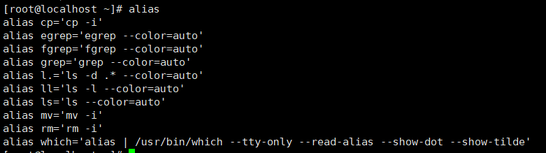

# 一、shell技术

## 1、shell特性

2、shell变量

3、shell条件测试

4、shell数值运算

5、流程，循环

- if
- case
- for
- while
- until
- break
- continue
- exit
- shift
- array
- function

6、企业项目


## 2、shell介绍

login shell	su - alice （会执行 /etc/profile	/etc/bashrc	~/.bash_profile	~/.bashrc）

nologin shell 	su alice (只会执行 /etc/bashrc	~/.bashrc)

和以下配置文件有关

系统变量	/etc/profile	/etc/bashrc

用户级别	~/.bash_profile	~/.bashrc	~/.bash_logout	~/.bash_history

logout和history是在离开时执行，其他四个是在进入shell执行

### 1、shell的历史命令和记忆功能

1、!number

!993表示执行history中993行的命令


2、!String

!da	表示找到最近一个以da开头的命令


3、!! 执行上一个命令


### 2、别名功能

1、alias	查看别名功能    unalias取消别名



alias cp	查看cp别名的含义为cp -i


2、设置别名

设置临时别名	alias  yang='date'


设置永久别名

vim ~/.bashrc，加上想配置的别名


因为~/.bashrc是在进入shell的时候执行，所以要不就重启shell生效，要不就重新执行一遍~/.bashrc文件

source ~/.bashrc	表示在当前shell执行文件

3、跳过别名

从别名可以看到cp其实表示的是cp -i,想要跳过别名直接执行cp可以通过两种方式

​	1、unalias直接取消别名

​	2、通过\cp跳过别名

### 3、快捷键功能

1、^D(crtl+D)退出


2、^A	^E将光标移动弄到命令的边界


3、^K	删掉光标之后的命令	^U	删掉光标之前的命令

4、^S	锁屏	输入的命令看不见但是会有效	^Q从锁屏状态恢复正常

5、^Y 撤销

### 4、命令排序

； &&  ||	

；不具备逻辑判断

&&  || 具备逻辑判断

./configure; make 表示不管./configure是否执行成功make都会执行

./configure && make	表示./configure执行成功后才会执行make

### 5.shell通配符(元字符)表示的不是本意

- *匹配任意多个字符
- ？匹配任意一个字符
- []匹配括号内任意一个字符[abc] [a-z] [0-9]
- ()在子shell中执行 (cd /home;ls)
- {}集合 touch file{1,2,5}
- \ 转义符 让元字符回归本意

### 6、echo输出带颜色文本

字体颜色是\e[1;30m--------\e[1;37m

背景色是\e[1;40m--------\e[1;47m

\e[0m表示将颜色重置回来


## 3、shell变量

### 变量类型

### 1、自定义变量

定义变量：	变量名=变量值 变量名必须以字母或者下划线开头，区分大小写 ip=192.168.0.100

引用变量：	$变量名 或 ${变量名}	$ip ${ip}

查看变量：	echo $变量名

取消变量：	unset 变量名

作用范围：	仅在当前shell中有效

### 2、环境变量

定义环境变量：方法一	export dir=/home/app

​							方法二	export dir 将自定义变量转换成环境变量

引用环境变量：	$变量名 或 ${变量名}

查看环境变量：	echo $变量名	env	例如：env | grep dir

取消环境变量：	unset 变量名

变量作用范围：	在当前shell和子shell中有效

### 3、位置变量

$1 $2 $3 $4 $5 $6 $7 $8 $9 ${10}

### 4、预定义变量

$0	脚本名

$*	所有的参数

$@	所有的参数

$#	参数的个数

$$	当前进程的PID

$!	上一个后台进程的PID

$?	上一个命令的返回值	0表示成功

变量赋值由三种方式

- 显示赋值:ip=192.168.0.102
- 从键盘读取: read ip
- 从执行脚本命令后面获取变量
- $? 表示获取上一条命令的结果
- $ip 表示获取变量ip的值

```shell
#!/usr/bin/bash
ip=192.168.0.102

# $ip表示获取变量ip的值
if ping -c1 $ip &>/dev/null; then
        echo "$ip is up!"
else
        echo "$ip is down!"
fi
        echo "shell is complete"

```

```shell
#!/usr/bin/bash
ip=192.168.0.102
ping -c1 $ip &>/dev/null
# $?表示获取上一个命令的结果
# fi和if是对应的，以if开始，以fi结束
if [ $? -eq 0 ]; then
        echo "$ip is up!"
else
        echo "$ip is down!"
fi
        echo "shell is complete"
```

```shell
#!/usr/bin/bash

#read表示从键盘获取数据
#read ip

#增加键盘输入提示
read -p "please input ip: " ip

ping -c1 $ip &>/dev/null
# $?表示获取上一个命令的结果
# fi和if是对应的，以if开始，以fi结束
if [ $? -eq 0 ]; then
        echo "$ip is up!"
else
        echo "$ip is down!"
fi
        echo "shell is complete"
```


一个简单的功能

 ./shell06.sh ip.txt 

```shell
#!/usr/bin/bash

# `basename $0`表示先执行basename $0
if [ $# -eq 0 ]; then
	echo "usage:`basename $0` file"
	exit
fi

# ! -f $1 表示 $1如果不是一个文件
if [ ! -f $1 ]; then
	echo "error file"
	exit
fi

for ip in `cat $1`
do
	ping -c1 $ip &>/dev/null
	if [ $? -eq 0 ]; then
		echo "$ip is up!"
	else
		echo "$ip is down!"
	fi
done
```

ip.txt

```shell
192.168.0.100
192.168.0.101
192.168.0.102
192.168.0.103
```

### 5、变量的赋值方式

**1、显示赋值**

变量名=变量值	ip=192.168.0.100

**2、read	从键盘读入变量值**

read	变量名

read -p "提示信息：" 变量名

read -t 5 -p "提示信息：" 变量名 (-t 5 倒计时5秒)

read -n 2 变量名(只需要输入的值的两位)

**3、定义或者引用变量时注意事项**

“” 双引号表示弱引用 引用的变量能正常显示

‘’	单引号表示强引用	引用的变量只能显示你输入的字母，而无法显示出变量值

``	命令替换	等价于 $() 	反引号中的shell会被先执行

​		df -h | grep '/$' | awk '{print $4}'	查找df -h中以/结尾的行数据，打印出第四个数据


### 6、变量的运算

<span style="color:red;">注意：shell中的变量没有类型，统一的都可以看做是字符串类型，所以变量无法进行直接的运算</span>

**1、整数运算**

​	a)	expr

​	expr 1 + 2

​	expr $num1 _$num2	+ - \\* / %	乘号*需要转义

​	

​	b)	$(())

​	$(($num1 + $num2))	+ - * / %


​	c)	$[]

​	echo $[5+2]	


​	d)	**let**

​	let sum=2+3; echo $sum

**2、小数运算**

echo "2*4" |bc

echo "2^4" |bc  //不保留小数

echo "scale=2;6/4" |bc   //保留两位小数 scale是固定格式


**3、变量内容的删除和替换**

echo ${url}	//打印出变量

echo ${#url}	//打印出变量长度

echo ${url#*.}	//将url第一个.**之前**的数据切割掉

echo ${url##*.}	//将最后一个.**之前**的数据删掉

echo ${url%.*}	//将url最后一个.**之后**的数据切割掉

echo ${url%%.*}	//将第一个.**之后**的数据删掉

**切割的使打印出的数据，url没有改变**


索引及切片

${url:0:5}	//从0开始切，总共切5个长度


替换

echo ${url/c/C}	//用C替换c，但是只是第一个

echo ${url//c/C}	//用C替换c,替换全部


赋值默认值 -

若变量**没有被定义**：会使用-后的值作为默认值

若变量**被定义**，就算是**空值**：不会使用默认值


赋值默认值2	:-

若变量**没有被定义**或是**空值**：会使用:-后的值作为默认值

若变量被定义，并且值不为空：不会使用默认值


### 7、符号的总结

()		子shell中执行

(())		数值比较，运算((1<2))

$()		命令替换

$(())		整数运算


{}		集合

${}		引用


[]		条件测试

[[]]		条件测试，支持正则 =~

$[]		整数运算


调试脚本：

​	sh	-n	01.sh	仅调试syntax error

​	sh	-vx	01.sh	以调试的方式执行，查询整个执行过程

## 4、条件测试

格式一： test	条件表达式

格式二：[条件表达式]

格式三：[[条件表达式]]

通过 **man test** 查看test的语法结构

表达式用小括号

字符串比较用	=	!=	......

数字比较用	-eq	-gt	-lt	......

**字符串变量最好都加上双引号**

```shell
   ( EXPRESSION )
              EXPRESSION is true
   
   ! EXPRESSION
          EXPRESSION is false

   EXPRESSION1 -a EXPRESSION2
          both EXPRESSION1 and EXPRESSION2 are true

   EXPRESSION1 -o EXPRESSION2
          either EXPRESSION1 or EXPRESSION2 is true

   -n STRING
          the length of STRING is nonzero

   STRING equivalent to -n STRING

   -z STRING
          the length of STRING is zero

   STRING1 = STRING2
          the strings are equal

   STRING1 != STRING2
          the strings are not equal

   INTEGER1 -eq INTEGER2
          INTEGER1 is equal to INTEGER2

   INTEGER1 -ge INTEGER2
          INTEGER1 is greater than or equal to INTEGER2

   INTEGER1 -gt INTEGER2
          INTEGER1 is greater than INTEGER2
```

### **1、根据内存占用比来发出信息**

```shell
#!/usr/bin/bash

mem_used=`free -m | grep '^Mem:' | awk '{print $3}'`
mem_all=`free -m | grep '^Mem:' | awk '{print $2}'`
mem_percent=$((mem_used*100/mem_all))
war_file=/tmp/mem_war.txt
rm -rf $war_file

echo "当前内存使用百分比：$mem_percent"

if [ $mem_percent -gt 90 ];then
	echo -e "\e[1;31m$(date +%F-%T) memmory_percent is ${mem_percent}%\e[0m" > $war_file
fi

if [ -f $war_file ];then
	mail -s "mem war..." lqj < $war_file
	rm -rf $war_file
fi

```

### 2、批量创建用户

```shell
#!/usr/bin/bash

#  create multi user
# create by lqj in 2019/09/26

read -p "Please input number:" num
while true
do
	if [[ ! $num =~ ^[0-9]+$ || $num =~ ^0+$ ]];then
		echo "num error"
		read -p "Please input number:" num
	else
		break
	fi
done

read -p "Please input presfix:" prefix
while true
do
	if [ ${#prefix} -eq 0 ];then
		echo "error prefix"
		read -p "Please input presfix:" prefix
	else
		break
	fi
done

#  seq $num 创建一个从1到$num的序列
for i in `seq $num`
do
	user=$prefix$i
	useradd $user
	
	# 设置创建用户的密码
	echo "123" |passwd --stdin $user &>/dev/null
	if [ $? -eq 0 ];then
		echo "$user is created."
	fi
done
```

## 5、模式匹配：case

### 1、case语法结构

```shell
case 变量 in

模式1）

​	命令序列1

​	；；

模式2)

​	命令序列2

​	；；

*）

​	无匹配后命令序列

esac
```

### 2、yum数据源的安装

```shell
#!/usr/bin/bash
#  yum

yum_server=172.20.10.8
os_version=`cat /etc/redhat-release | awk '{print $4}' | awk -F'.' '{print $1"."$2}'`

[ -d /etc/yum.repos.d ] || mkdir /etc/yum.repos.d/bak
mv /etc/yum.repos.d/*.repo /etc/yum.repos.d/bak

case "$os_version" in
7.3)
	cat >/etc/yum.repos.d/centos7u3.repo <<-EOF
	[centos7u3]
	name=centos7u3
	baseurl=ftp://$yum_server/centos7u3
	gpgcheck=0
	EOF
	echo "7.3 yum config.."
	;;
6.8)
	curl -o /etc/yum.repos.d/centos6u8.repo ftp://$yum_server/centos6u8.repo
	;;
5.9)
	curl -o /etc/yum/repos.d/CentOS-Base.repo http://mirrors.aliyun.com/repo/Centos-5.repo
	;;
*)
	echo "error"

esac
```

## 6、if语句

### 1、apache安装

```shell
#!/usr/bin/bash
# install apache

gateway=192.168.1.11

ping -c1 www.baidu.com &>/dev/null
if [ $? -eq 0 ];then
        yum -y install httpd
        systemctl start httpd
        systemctl enable httpd

        firewall-cmd --permanent --add-service=http
        firewall-cmd --permanent --add-service=https
        firewall-cmd --reload

        sed -ri '/^SELINUX=/cSELINUX=disabled' /etc/selinux/config
        setenforce 0
elif ping -c1 $gateway &>/dev/null;then
        echo "check dns..."

else
        echo "check ip address"
fi

```

## 7、for循环

### 1、批量ping操作脚本

```shell
#!/usr/bin/bash
# 批量ping操作

for i in {2..254}
do
        {
        ip=172.20.10.$i

        # -W表示超时  -W1表示超时1秒
        ping -c1 -W1 $ip &>/dev/null

        # tee -a ip.txt是把结果输入到控制台的同时把结果输入到ip.txt 添加
        if [ $? -eq 0 ];then
                echo "$ip is up" |tee -a ip.txt
        fi
        }&

done

# wait等待前面的后台进程结束
wait
echo "finished"
```

### 2、for实现批量用户创建

```shell
#!/usr/bin/bash
# create by liuqijia in 2019/10/14

while :
do
        read -p "Please enter prefix & pass & num[liuqijia 123 5]: " prefix pass num
        printf "user information:
        ---------------------------------------
        user prefix: $prefix
        user password: $pass
        user number: $num
        ---------------------------------------
        "
        read -p "Are you sure?[y/n]" action
        if [ "$action" = "y" ];then
                break
        fi
done

for i in `seq -w $num`
do
        user=$prefix$i
        id $user &>/dev/null
        if [ $? -eq 0 ];then
                echo "user $user already exists"
        else
                useradd $user
                echo "$pass" |passwd --stdin $user &>/dev/null
                if [ $? -eq 0 ];then
                        echo "$user is created"
                fi
        fi
done
```

### 3、for实现文件中批量用户创建

```shell
#!/usr/bin/bash
# create by liuqijia in 2019/10/14

pass=123
# 如果参数个数为0
if [ $# -eq 0 ];then
        echo "usage: `basename $0` file"
        exit 1
fi

# 如果参数不是个文件
if [ ! -f $1 ];then
        echo " error file" 
        exit 2
fi


#希望for处理文件按回车分割，而不是空格或者tab空格
#重新定义分隔符
#IFS内部字段分隔符
#IFS=$'\n'
IFS='
'
for line in `cat $1`
do
        # 如果是空行，跳出这次循环
        if [ ${#line} -eq 0 ];then
                continue
        fi      
        user=echo "$line" |awk '{print $1}'
        pass=echo "$line" |awk '{print $2}'
        id $user &>/dev/null
        if [ $? -eq 0 ];then
                echo " user $user already exists"
        else
                useradd $user
                echo "$pass" |passwd --stdin $user &>/dev/null
                if [ $? -eq 0 ];then
                        echo "$user is created..."
                fi
        fi
done
```

### 4、for实现批量主机密码修改

```shell
#!/usr/bin/bash
# create by liuqijia in 2019/10/14

#>ok.txt
#>fail.txt
read -p "Please enter a new password: " pass

for ip in `cat ip.txt`
do
        {
        ping -c1 -W1 $ip &>/dev/null
        if [ $? -eq 0 ];then
                ssh $ip "echo $pass |passwd --stdin lqj"
                if [ $? -eq 0 ];then
                        echo "$ip" >>ok_`date +%F`.txt
                else
                        echo "$ip" >>fail_`date +%F`.txt
                fi
        else
                echo "$ip" >>fail_`date +%F`.txt
        fi
        }&
done
wait
echo "finished..."
```

### 5、for实现批量远程主机ssh配置

```shell
#!/usr/bin/bash
# create by lqj in 2019/10/14

for ip in `cat ip.txt`
do
        {
        ping -c1 -W1 $ip &>/dev/null
        if [ $? -eq 0 ];then
                ssh $ip "sed '/^#UseDNS/cUseDNS no/' /etc/ssh/sshd_config"
                ssh $ip "sed '/^#GSSAPIAuthentication/cGSSAPIAuthentication no/' /etc/ssh/sshd_config"
                ssh $ip "sed '/^#SELINUX=/cSELINUX=disabled/' /etc/selinux/config"
                ssh $ip "systemctl stop firewalld; systemctl disable firewalld"
                ssh $ip "setenforce 0"
        fi
        }&
done
wait
echo "all ok..."

```

## 8、while循环

### 1、while循环读取文件

```shell
#!/usr/bin/bash
# create by lqj in 2019/10/15

while read user
do
        echo "$user"
done < user01.txt
```

user01.txt

```shell
rrr1 123
aaa 456
bbb 789
```

### 2、while循环创建用户

```shell
#!/usr/bin/bash
# create by lqj in 2019/10/15

while read line
do
        # 如果是空格的话直接跳过
        if [ ${#line} -eq 0 ];then
                continue
        fi
        user=`echo $line|awk '{print $1}'`
        pass=`echo $line|awk '{print $2}'`
        id $user &>/dev/null
        if [ $? -eq 0 ];then
                echo "user $user already exists!!!"
        else
                useradd $user
                echo "$pass" |passwd --stdin $user &>/dev/null
                if [ $? -eq 0 ];then
                        echo "$user is created."
                fi
        fi
done < user01.txt
```

### 3、while util测试远程主机连接

while 条件为真执行

```shell
#!/usr/bin/bash
# create by lqj in 2019/10.25

ip=172.20.10.1
while ping -c1 -W1 $ip &>/dev/null
do
        sleep 1
done
echo "$ip is down"
```

util条件为假执行

```shell
#!/usr/bin/bash
# create by lqj in 2019/10.25

ip=172.20.10.1
until ping -c1 -W1 $ip &>/dev/null
do
        sleep 1
done
echo "$ip is up
```

### 4、fd和命名管道实现shell并发控制

```shell
#!/usr/bin/bash
# create by lqj in 2019/20/15
#  按照执行并发数量去ping

thread=5
tmp_fifofile=/tmp/$$.fifo
# 创建管道文件
mkfifo $tmp_fifofile
exec 8<> $tmp_fifofile
rm $tmp_fifofile

for i in `seq $thread`
do
        echo >&8
done

for i in {1..254}
do
        read -u 8
        {
        ip=172.20.10.$i
        ping -c1 -W1 $ip &>/dev/null
        if [ $? -eq 0 ];then
                echo "$ip is up"
        else
                echo "$ip is down"
        fi
        echo >&8
        }&

done
wait
exec 8>&-
echo "all finished"
```

## 9、数组

### 1、数组的基本概念

普通数组：只能使用整数作为数组索引 

关联数组：可以使用字符串作为数组索引 

#### 一、普通数组 

定义数组：

方法一： 一次赋一个值 

**数组名[下标]=变量值** 

#array1[0]=pear 

#array1[1]=apple 

方法二： 一次赋多个值 

#array2=(tom jack alice) 

查看数组： 

declare -a 

declare -a array1='([0]="pear" [1]="apple" [2]="orange" [3]="peach")'


访问数组元数： 

echo ${array1[0]} 		访问数组中的第一个元数 

echo ${array1[@]} 	   访问数组中所有元数 等同于 echo ${array1[*]} 

echo ${#array1[@]} 	统计数组元数的个数 


**echo ${!array2[@]} 获取数组元数的索引** 


#### 二、关联数组

**注意:使用关联数组前一定要将此数组申明为关联数组，否则shell默认会认为是普通数组**

定义关联数组： 

申明关联数组变量 

declare -A ass_array1

方法一： 一次赋一个值 

数组名[索引]=变量值 

ass_array1[index1]=pear 

ass_array1[index2]=apple 

方法二： 一次赋多个值 

ass_array2=([index1]=tom [index2]=jack [index3]=alice [index4]='bash shell') 


查看数组： 

**declare -A** 


访问数组元数： 

echo ${ass_array2[index2]} 访问数组中的第二个元数 

echo ${ass_array2[@]} 访问数组中所有元数 等同于 echo ${array1[*]}

echo ${#ass_array2[@]} 获得数组元数的个数 

echo ${!ass_array2[@]} 获得数组元数的索引 


### 2、array数组的赋值及遍历

```shell
#!/usr/bin/bash
# create by lqj in 2019/10/15

while read line
do
	host[i++]=$line
done </etc/hosts

# 不能写成`${!host[@]}`，否则会报错
for i in ${!host[@]}
do
	echo "$i: ${host[i]}"
done
```

```shell
#!/usr/bin/bash
# create by lqj in 2019/10/15
OLD_IFS=$IFS
IFS=$'\n'

for line in `cat /etc/hosts`
do
        host[i++]=$line
done 

for i in ${!host[@]}
do
        echo "$i: ${host[$i]}"
done

# 将分隔符换回默认的分隔符
IFS=$OLD_IFS
```

统计性别

```shell
#!/usr/bin/bash
# create by lqj in 2019/10/15

declare -A sex

while read line
do
	type=`echo $line |awk '{print $2}'`
	let sex[$type]++
done <sex.txt

for t in ${!sex[@]}
do
	echo "$t: ${sex[$t]}"
done
```

sex.txt

```shell
a	m
b	f
c	m
d	f
e	m
```

## 10、function函数

传参 $1,$2 

变量 local 

返回值 return $? 

### 一、定义函数 

方法一： 
函数名() { 
	函数要实现的功能代码 
}

方法二： 

function 函数名 { 

​	函数要实现的功能代码 

} 

### 二、调用函数 

函数名 

函数名 参数 1 参数 2 


计算阶乘

```shell
#!/usr/bin/bash
# create by lqj in 2019/10/15

factorial(){
	f=1
	for((i=1;i<=5;i++))
	do
	f=$(($f*$i))
	done
	echo "5的阶乘是: $f"
}

factorial
```

函数传参

```shell
#!/usr/bin/bash
# create by lqj in 2019/10/15

factorial(){
	f=1
	for((i=1;i<=$1;i++))
	do
	f=$(($f*$i))
	done
	echo "$1的阶乘是: $f"
}

factorial 10
```

函数的返回值

```shell
#!/usr/bin/bash
# create by lqj in 2019/10/15

fun2(){
read -p "please enter a num: " num
echo $[$num*2]
}

result=`fun2`
echo "fun2 return value: $result"
```

### 三、函数的传参

#### 1、位置参数

```shell
#!/usr/bin/bash
# cretae by lqj in 2019/10/16

if [ $# -ne 3 ];then
        echo "usage: `basename $0` par1 par2 par3"
        exit
fi

fun(){
        # 这个位置的$1 $2 $3是函数的位置参数
        echo "$(($1*$2*$3))"
}

# 这个位置的$1 $2 $3是脚本的位置参数
result=`fun $1 $2 $3`
echo "result is: $result"
```

#### 2、数组变量

```shell
#!/usr/bin/bash
# create by lqj in 2019/10/16

num=(1 2 3 4 5)
echo "num: ${num[@]}"

array(){
        factorial=1

        # 用$@或者$*接收所有的函数参数
        for i in $@
        do
                let factorial=$[$factorial*$i]
        done
        echo "factorial: $factorial"

}

array ${num[@]}
```

输出数组变量

```shell
#!/usr/bin/bash
# create by lqj in 2019/10/16

num=(1 2 3)
num2=(2 3 4)

array(){
	# shell中所有的变量默认为全局变量，若要使用局部变量需要加上local关键字
	local newarray=($@)
	local i
	for((i=0;i<$#;i++))
	do
		newarray[$i]=$((${newarray[$i]}*5))
	done
	echo "${newarray[@]}"
}

array ${num[@]}
array ${num2[@]}
```

```shell
#!/usr/bin/bash
# create by lqj in 2019/10/16
num2=(2 3 4)

array(){
        local i
        local newarray=()
        for i in $@
        do
                newarray[j++]=$(($i*5))
        done
        echo "${newarray[@]}"
}

array ${num2[@]}

#函数接收位置参数 $1 $2 $3...
#函数接收数组变量 $* 或 $@
#函数将接收到的所有参数赋值给数组 newarray=($*)
```

## 11、shell的内置命令

1、shift	位置参数向左移


./shift.sh 1 2 3

```shell
#!/usr/bin/bash
# create by lqj in 2019/10/17

while [ $# -ne 0 ]
do
        let sum+=$1
        echo "第一个位置参数为: $1"
        shift 3
done
echo "num is: $sum"
```

## 12、sed的相关

1、去除空行和注释行

-i 表示更改到文件(不加的话只会显示结果，但更改不会改变到文件)

^[ \t]*#  表示以**0到多个空格**或**tab**或者**#**开头的行

^$  表示空行

/d 表示删除

```shell
sed -i '/^[ \t]*#\|^$/d' /etc/passwd
```

